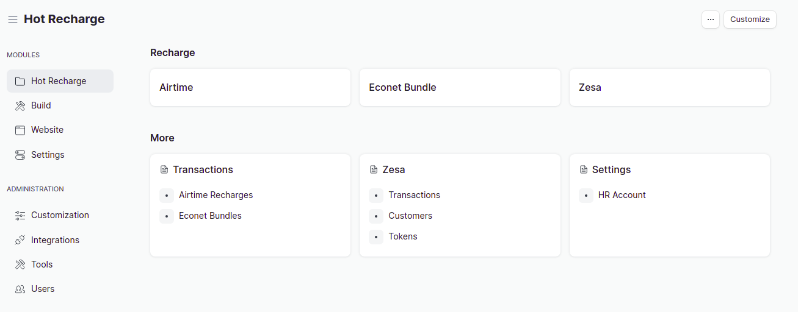

## Hot Recharge App

Hot Recharge App in Frappe ERPNEXT

### Installation
* Clone this repository  OR
1. bench get-app --branch feat/smpl-sol hot_recharge_app  https://github.com/DonnC/hot_recharge_app.git

2. bench --site `site-name` install-app hot_recharge_app

### Setup
After setup, configure your hot recharge settings under Settings > HR Account

### Update
run `bench --site sitename migrate`

### Demo

#### License

MIT
